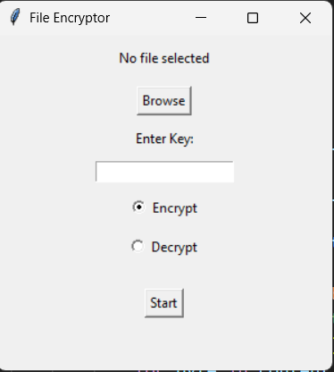

# 🔐 File Encryptor (Tkinter GUI)

A simple Python GUI tool to **encrypt and decrypt files** with a custom integer key.  
It uses a **basic byte-shift encryption** plus random padding for file size obfuscation.  

---

## 🚀 Features
- GUI built with **Tkinter**
- Encrypt and decrypt files with a custom key
- Hides original file during encryption
- Adds random padding for extra protection

---

## 📷 Screenshot


---

## 📦 Installation
Clone the repository:
```bash
git clone https://github.com/your-username/FileEncryptor-GUI.git
cd FileEncryptor-GUI
```

Install requirements (Python 3.x needed):
```bash
pip install -r requirements.txt
```

---

## ▶️ Usage
Run the app:
```bash
python projectt.py
```

1. Browse and select a file.  
2. Enter a numeric key.  
3. Choose **Encrypt** or **Decrypt**.  
4. Click **Start**.  

Encrypted files get `.enc` extension, original files are hidden with `.original`.

---

## ⚠️ Disclaimer
This is a **basic educational project**.  
Do **NOT** use it for real-world security — it is not cryptographically secure.  

---

## 📜 License
MIT License
